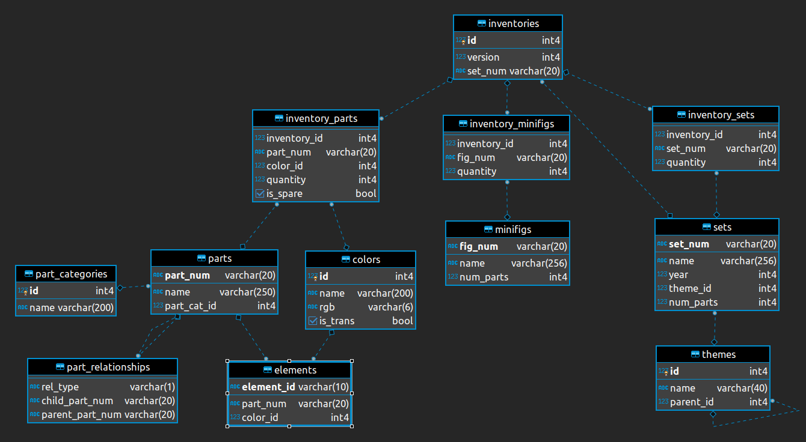
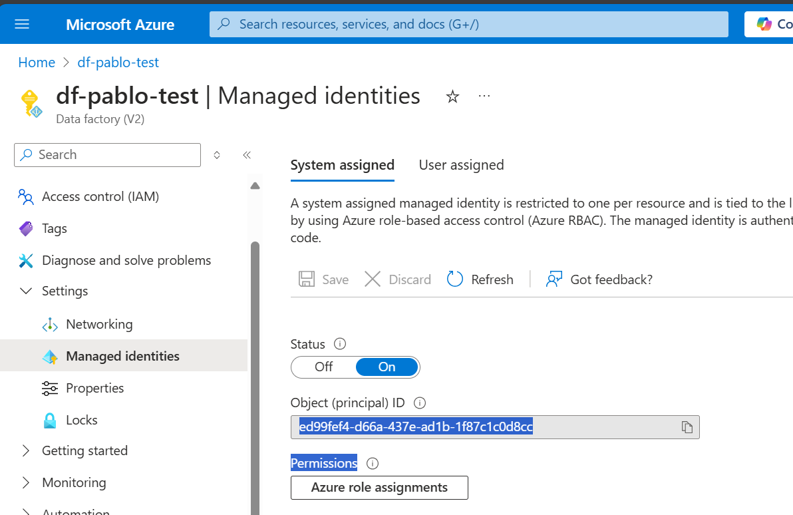
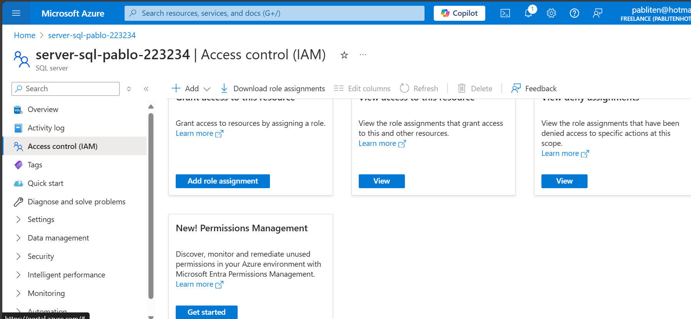
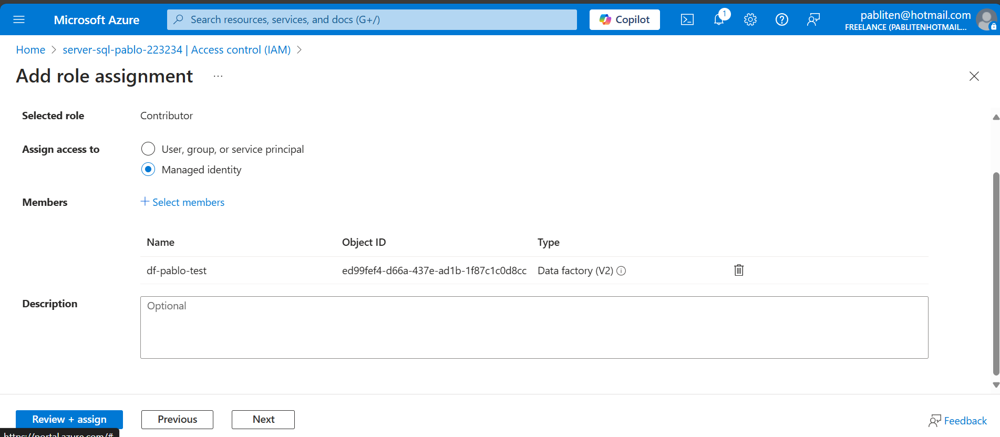
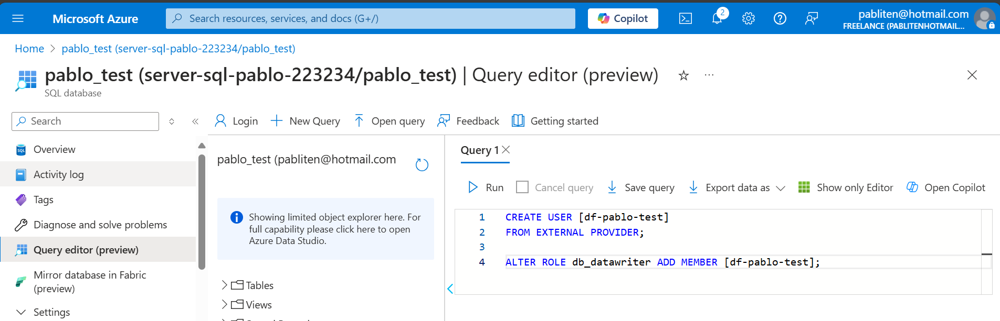
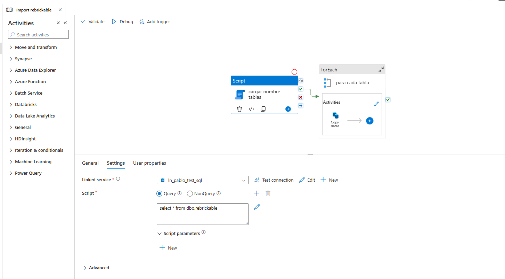
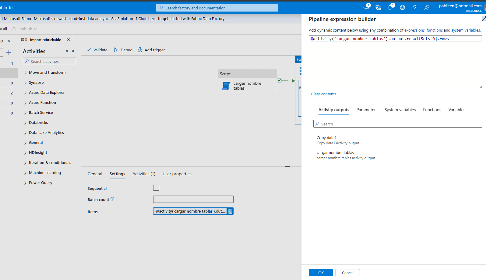
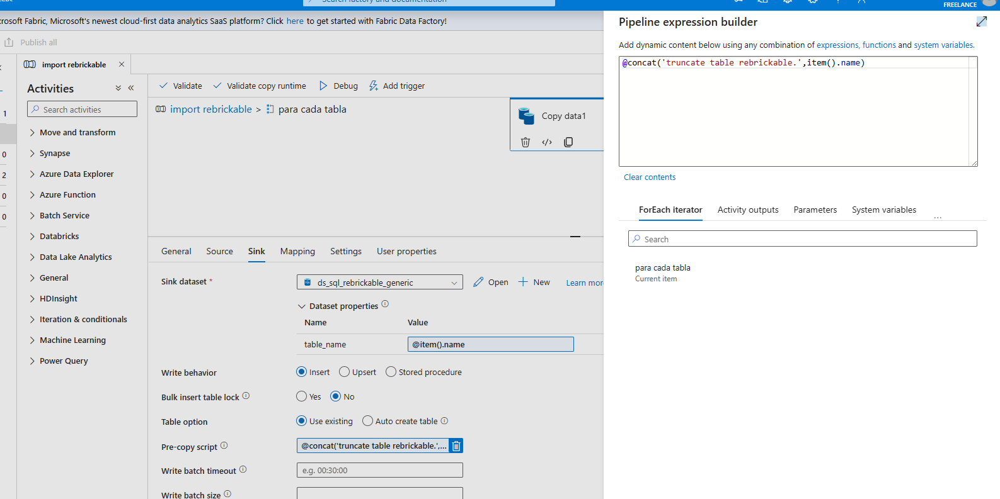

# Lego-rebrictable

This is a very simple project created with the intention to have a basic project for a junior data engineer.

The goal of this project is to help people and at the same time, to try ways to organize a data engineering repository in github since is the very first time I try to create one for data engineering projects.

# Explanation of the project

1. ingest data using HTTP activity from rebrickable.com (a public site of Lego with the catalog of pieces https://rebrickable.com/downloads/). This is a ER shared by this site:
   
2. simple exploration of data (TBC)
3. simple dashboard (TBC)

# How to install and run
1. create new datafactory resource
2. create new azure sql resource
3. enable use of system managed identity on datafactory
   
4. add this system managed identity to azure sql server role contributor:
   
   
5. in Azure sql server create a login and add it to azure database roles db_datareader, db_datawriter and ddl_admin. This can be done executing the [script](queries/create_datafactory_user.sql)
   
6. on Azure sql server, create the schema and tables where data will be ingested, you can do that executing the following [script](queries/create_schema_rebrickable.sql)
7. create a new linked service in datafactory to sql server and http site.
8. import pipeline and resources  this [export](<datafactory/import rebrickable_support_live.zip>)
9. trigger the pipeline or debug it
   

# Description of the pipeline
This is a very simple pipeline which uses a ForEach and three  activities: HTTP, Script and Copy data.

The first activity load from a table in Azure sql the tables name that will be loaded from the download page into Azure Sql

This data will be passed to each instance of copy activity. before ingest new data, previous ingested one will be deleted on each table:

# Technologies used
1. data factory
2. sql server
3. power bi (TBC)

